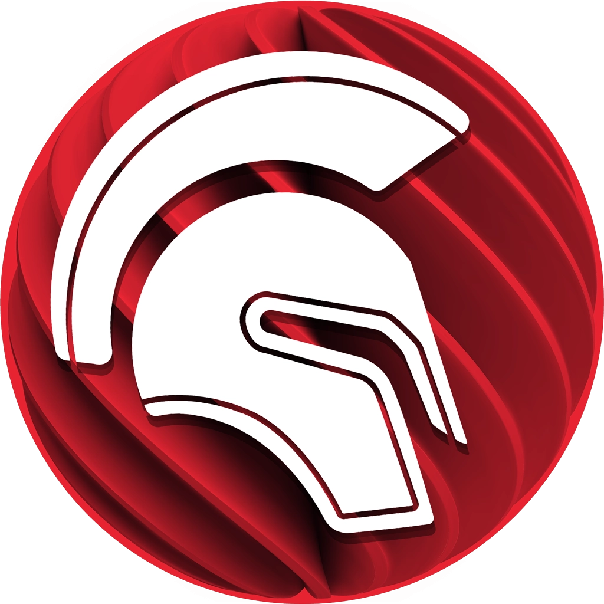

# T1A3 Terminal App Assignment

## Functionality
- The purpose of this app is entertainment and to test how well users know commonly used logos and icons for programming languages and frameworks. 

## Design
- In order to run this app you will need to install Python3, installation instructions can be found here: [Python installation](https://www.python.org/downloads/)
- Install git, installation instructions can be found here : [git installation](https://git-scm.com/downloads)
- Clone the repository from github by typing the following command into your terminal:
    ```git clone https://github.com/E-Holt/t1a3.git```
- You then open your terminal on your computer and type in the following:
    ```./src/executegg.sh help``` 
    for how to install and play this game.
    ```./src/executegg.sh``` 
    to go to the main menu and play the game!
- If your terminal says you don't have permission, run this script then try again:
    ```chmod +x src/executegg.sh```
- This program should work on any computer and operating system capable of installing python3. 

## How to play
- You can view the logos and icons used in this game in the README file in the folder containing the game.
- This game is played by following the prompts. 
- In the menu, please type in the relevant number and press the enter key. 
- If you've chosen to view the instructions you can then press enter again to return to the menu. 
- If you've chosen to play the game, the game will give you a hint then prompt you for a colour name. 
- Please type in the colour name in lower cased letters, then press enter. 
- If you type in the incorrect colour or any other word that is not the colour, it will count as an incorrect guess and you'll be given a new hint for the same colour.
- Remember you only have five guesses! 
- If you don't guess correctly within those five guesses, you'll be asked if you want to play again. 
- Please type in “yes” or “no” and press enter. 
- If you guessed correctly, you'll be given a score based on how many guesses it took and will be asked if you'd like to play again. 
- If you guess correctly in multiple rounds, you'll be shown your total score for all the rounds you've played if you haven’t exited the game. 
- When you're done playing, you can choose "no" to playing again, or exit the terminal at any point. 
- Thanks for playing the game!

## My repository can be found at:
    [Repository](https://github.com/E-Holt/t1a3)

## Styling Conventions
- I used the Python variable naming convention snake case for naming variables and functions (Python Variable Names, 2022).

## Features
### 1. Menu feature
- The menu feature is a basic menu that allows the user to choose what they'd like to do. It has some error handling capabilities for inputs that aren't a menu option and uses imported data to connect with other files used in the program, as well as an imported module to allow the screen to be cleared. It also uses a while loop and conditional statements to allow the user to choose options efficiently and with minimal risk of breaking if something goes wrong. 
    

### 2. Hints feature
- The hints freature is spread across a couple files and a couple functions to allow the program to choose a random colour and shuffle the related hints list in order to give hints that wont be in the same order on any given round. This involves using a list relevant to each colour, multiple if statments in order to correctly choose the list, an imported random module to randomise the colour choice and shuffle the hints list, as well as a while loop for giving the hints dependant on if the input was correct or not. The hints feature is mostly not interacted with by the user, but does have some error handling capabilities with the rest of the game_input function when the user inputs something that isn't usable.
    
    

### 3. Scoring keeping feature
- The scoring feature if found in the  game_input function and the point_counter function. It uses a variable that starts at zero and calculated the points in a round based on how many guesses were input before a correct guess, if a correct guess is given. Additionally, the point_counter function tracks those points and adds them together each round to give a total game score which is reset when the program is exited. The scoring feature is involved in a while loop along with the hints function mentioned above as well as conditional statements dependant on whether the input was a correct guess or not. The scoring feature itself doesn't have error handling function, but utilises the error handling in the game_input function when an incorrect guess is given. 
    

## Development
- I used a flow chart to plan the general course of how the game would work and the different functions I needed to create. 
    

## Implementation Plan
- I used Trello to keep track and what I was working on and what needed to be done by a certain date. The Trello board can be found here [Trello board](https://trello.com/b/iTM13wmX/t1a3-board)
    

- outlines how each feature will be implemented and a checklist of tasks for each feature
- prioritise the implementation of different features, or checklist items within a feature
- provide a deadline, duration or other time indicator for each feature or checklist/checklist-item
### Menu feature
- The menu feature was one of the first I worked on as I used similar code to a tutorial we had done. I had to learn how to use the os library import to use the system module within the menu feature. I had all of my featured due on 14/07 to allow testing time before presenting on 15/07. This is the checklist I used for the menu feature.
    - List menu options
    - Link menu options with relevant functions
    - Figure out how to quit program
    - Create error response 
    - Test menu function
### Hints feature
- The hints feature is the second feature I focussed on as it is one of the more complicated features in the game. I had to take the time to understand the random module in Python and how to get functions to work together as well as import files into each other to get it working in a way that wasn't cluttered. This was also due on 14/07 to make sure I allowed time for testing and was ready for presenting on 15/07, however I made sure it was functional by 13/07 to allow for adequate testing with the other functions.This is the checklist I used for the hints feature:
    - List hints in an accessible manner
    - Create function for randomly choosing colour
    - Create function for randomly choosing hints
    - Get functions working together
    - Test performance of hints system
### Score Keeping feature
- The score keeping feature was complicated to figure out for being smaller compared to the hints feature. I tried multiple different ways to get the feature to keep track of points between rounds, but ended up using a global variable and simplifying it as much as I could. This also involed figuring out how to get functions working together, which I had trouble with to begin with but thankfully figured out. This feature had the same time frame as the others, but I was able to complete it by the 13th with some minor fixes by the 15th. This is the checklist I used for the score keeping feature:
    - Create relevant scoring system
    - Create function for keeping score across games
    - Connect score functions with main game functions
    - Create error handling
    - Test score keeping function

## Logos and Icons used


 
 


 




## Reference List:

W3schools.com. 2022. Python Variable Names. [online] Available at: <https://www.w3schools.com/python/gloss_python_variable_names.asp> [Accessed 15 July 2022].